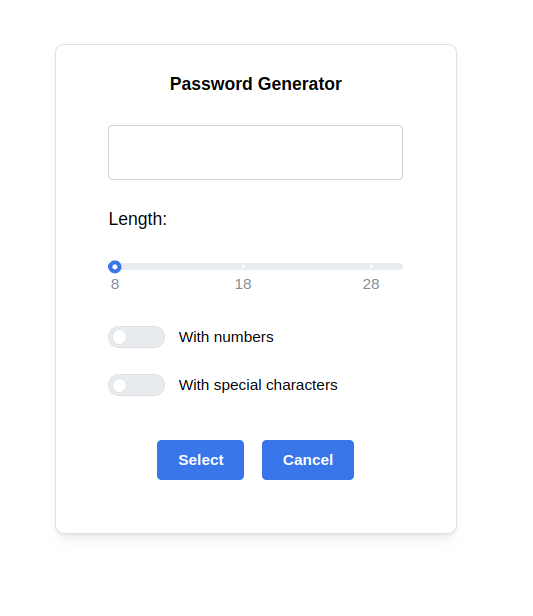

This is a [Next.js](https://nextjs.org/) project bootstrapped with [`create-next-app`](https://github.com/vercel/next.js/tree/canary/packages/create-next-app).

I'm using [Mantine](https://mantine.dev/) to style it.
Password-generator is a React component that can be configured to provide a password based on the password generator API.

